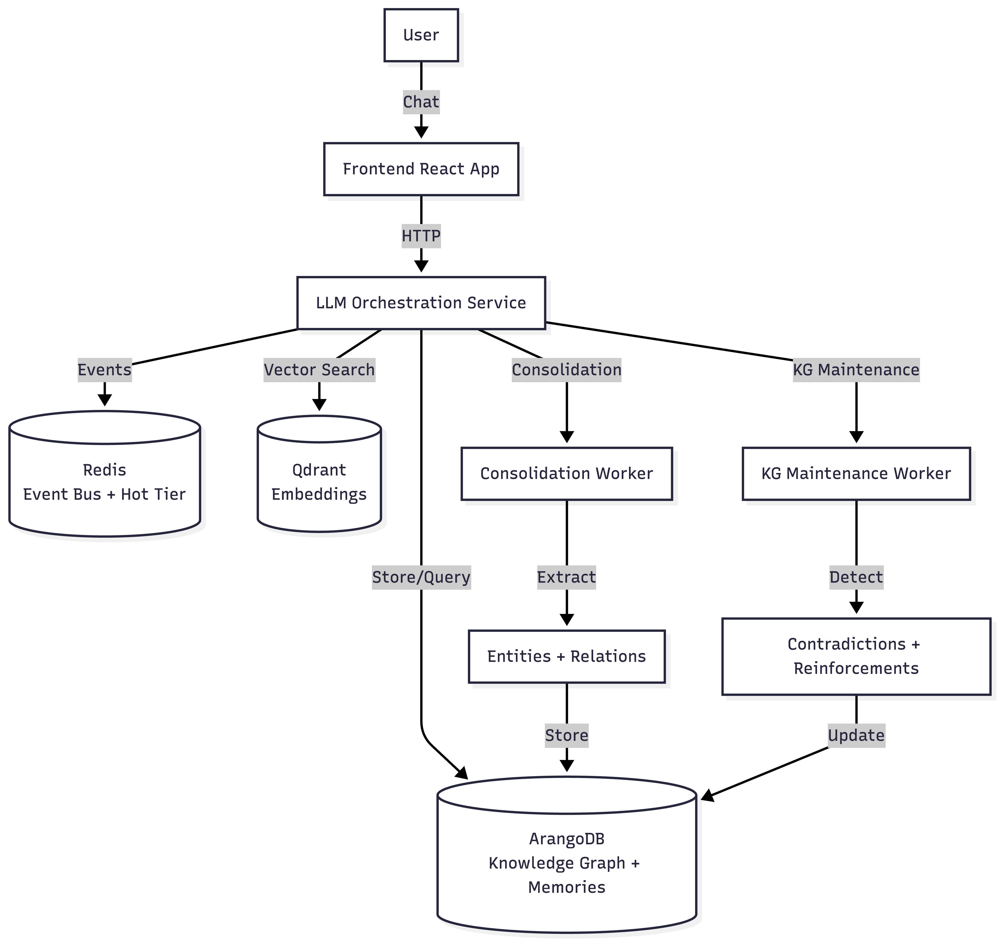

# Datclaw Memory Engine

**An intelligent, self-maintaining memory system for AI agents** (codename: DAPPY)

Datclaw is a memory engine that goes beyond simple vector search. It combines semantic retrieval with a self-maintaining knowledge graph, ego-based importance scoring, and context-aware summarization to give AI agents accurate, relevant, and evolving memory.

## Why Datclaw?

Most memory systems are just vector databases with basic retrieval. Datclaw is different:

- **Ego Scoring**: Automatically determines what's important to remember based on temporal recency, explicit signals, novelty, sentiment, and engagement
- **Self-Maintaining Knowledge Graph**: Extracts entities and relations, detects contradictions, reinforces repeated facts, and cleans up outdated information - all automatically in the background
- **Context Summarization**: Captures factual statements from assistant responses, not just user messages, for richer retrieval
- **Batched Consolidation**: Processes multiple memories in parallel for 10x faster ingestion
- **Tiered Memory**: Hot (Redis), warm (ArangoDB), cold (S3) - memories age gracefully based on importance

## Architecture

See the detailed system architecture here -

## Quick Start

### Prerequisites

- Docker & Docker Compose
- Python 3.9+ (3.12 recommended)
- Node.js 18+ (optional, for frontend)
- OpenAI API key

### One-Command Setup

```bash
git clone https://github.com/SaswataPatra/Datclaw-Memory-Engine.git
cd Datclaw-Memory-Engine

# Run the setup script (handles everything)
./setup.sh        # macOS/Linux
# OR
setup.bat         # Windows
```

The script will:
1. Check prerequisites (Docker, Python, Node.js)
2. Create `.env` from template
3. Start Docker services (Redis, ArangoDB, Qdrant)
4. Set up Python virtual environment
5. Install dependencies (you choose: core only or core + ML)
6. Optionally set up frontend

### Manual Setup (if you prefer)

```bash
# 1. Configure environment
cp .env.example .env
# Edit .env: add OPENAI_API_KEY and ARANGODB_PASSWORD

# 2. Start Docker services
docker-compose up -d

# 3. Install backend
cd llm-orchestration
python -m venv .venv
source .venv/bin/activate  # Windows: .venv\Scripts\activate
pip install -r requirements.txt  # Core only (~200MB)
# pip install -r requirements-ml.txt  # Optional: ML features (~2-3GB)

# 4. Start backend
./start_service.sh
```

### Verify Installation

```bash
# Check backend health
curl http://localhost:8000/health

# Test chat (CLI)
cd llm-orchestration
./chat.sh
```

## Production Deployment

### Hosted Service (Recommended)

**Want a managed solution?** We offer a fully hosted version of Datclaw Memory Engine:
- No infrastructure management
- Automatic updates and scaling
- Enterprise support
- 99.9% uptime SLA

👉 **[Sign up for hosted service](https://datclaw.ai)** (Coming Soon)

### Self-Hosted

For self-hosting, you can use the development setup with proper security:

```bash
# 1. Configure .env with production secrets
# - Use strong passwords (min 16 chars)
# - Add production OpenAI API key
nano .env

# 2. Start services
docker-compose up -d

# 3. Set up reverse proxy (Nginx/Caddy) with HTTPS
# 4. Configure firewall and monitoring
# 5. Set up backups
```

**Note:** Self-hosting requires infrastructure management, security hardening, and ongoing maintenance. Consider the hosted service for production use.

## Key Features

### 1. Ego Scoring

Automatically scores memory importance (0-1) based on:
- **Temporal recency**: Recent memories score higher
- **Explicit signals**: "This is important", "Remember this"
- **Novelty**: New information vs repeated facts
- **Sentiment intensity**: Strong emotions indicate importance
- **Engagement**: Questions, follow-ups, corrections

Memories are tiered (Tier 1-4) and aged out based on ego score.

### 2. Knowledge Graph Maintenance

Background agent that:
- Extracts entities and relations from conversations
- Detects contradictions (e.g., "My father is John" vs "My father is James")
- Resolves conflicts automatically (removes outdated facts)
- Reinforces repeated relations (supporting mentions++)
- Cleans up low-confidence relations

### 3. Context Summarization

Captures factual statements from assistant responses:
- "I painted a sunrise on January 15th" → `context_summary: "Melanie painted a sunrise on January 15th"`
- Used during retrieval to surface assistant-provided facts
- Critical for multi-hop reasoning

### 4. Batched Consolidation

Processes up to 10 memories in a single LLM call:
- 10x faster than per-memory consolidation
- Parallel processing (5 batches at a time)
- Reduces API costs significantly

## API Endpoints

### Chat
- `POST /chat` - Send message, get response with memory context
- `POST /chat/stream` - Streaming chat responses

### Memory Management
- `GET /context/manage` - Get user's memories
- `DELETE /context/manage` - Delete specific memories
- `POST /context/flush` - Flush context (move to long-term storage)

### Ingestion
- `POST /ingest/session-json` - Ingest conversation sessions (JSON format)
- `POST /ingest/chatgpt-export` - Import ChatGPT conversations

### Benchmarking
- `POST /benchmark/ingest` - Ingest benchmark data
- `POST /benchmark/search` - Search with context summary
- `POST /benchmark/answer` - Answer with memory context

### Health
- `GET /health` - Service health check

### Authentication
- `POST /auth/signup` - Create account
- `POST /auth/login` - Login and get JWT token

## Documentation

Detailed documentation is available in the [`docs/`](docs/) directory:

- [Quick Start](QUICK_START.md) - Get running in 5 minutes
- [Startup Guide](STARTUP_GUIDE.md) - Comprehensive development setup
- [Troubleshooting](TROUBLESHOOTING.md) - Common issues and solutions
- [Dependencies](llm-orchestration/DEPENDENCIES.md) - Core vs ML installation
- [Contributing](CONTRIBUTING.md) - How to contribute to the project
- [Architecture](docs/architecture.md) - System design and data flow
- [Architecture TODO](docs/ARCHITECTURE_TODO.md) - Refactoring backlog
- [KG Maintenance](docs/kg-maintenance.md) - How the knowledge graph stays clean
- [Ego Scoring](docs/ego-scoring.md) - Memory importance algorithm
- [Benchmarking](docs/benchmarking.md) - Running MemoryBench tests

## Testing

Run unit tests to verify core functionality:

```bash
cd llm-orchestration

# Run all unit tests
pytest tests/unit/ -v

# Run specific test suites
pytest tests/ego_scoring/ -v
pytest tests/graph/ -v
pytest tests/integration/ -v

# Run with coverage
pytest tests/unit/ --cov=. --cov-report=html
```

## Configuration

The system is configured via `llm-orchestration/config/base.yaml`. Key settings:

- **LLM Provider**: OpenAI (default), Ollama (free, local), Anthropic
- **Embedding Model**: `text-embedding-3-small` (default)
- **Ego Scoring**: Component weights, thresholds, recency half-lives
- **Consolidation**: Batch size, parallel processing
- **ML Classifier**: LLM-based (fast), HuggingFace API, or regex (no API calls)

## Utilities

Useful CLI tools in `llm-orchestration/scripts/`:

```bash
# Reset all databases (Redis, ArangoDB, Qdrant)
python scripts/reset_all_databases.py

# Inspect memory-graph linkage
./scripts/inspect_graph.sh list --limit 10
./scripts/inspect_graph.sh inspect --memory-id <id>
./scripts/inspect_graph.sh find-entity --entity "Melanie"

# Delete specific memories
python utils/delete_memory.py <memory-id-1> <memory-id-2>

# Delete graph data
python utils/delete_graph_data.py --user <user-id>
python utils/delete_graph_data.py --entity <entity-id>
```

## Benchmarking

Datclaw can be benchmarked using [MemoryBench](https://github.com/supermemoryai/memorybench):

1. Clone MemoryBench alongside this repo
2. Follow the setup guide in [`docs/benchmarking.md`](docs/benchmarking.md)
3. Run: `bun run --provider dappy --concurrency-ingest 5`

## Project Structure

```
Datclaw-Memory-Engine/
├── llm-orchestration/     # Core Python backend
│   ├── api/               # FastAPI endpoints
│   ├── core/              # Event bus, KG store, scoring
│   ├── services/          # Chatbot, ingestion, consolidation
│   ├── workers/           # Background workers (consolidation, KG maintenance)
│   ├── ml/                # ML classifiers and scorers
│   ├── tests/             # Comprehensive test suite
│   └── config/            # Configuration
├── frontend/              # React + Vite chat UI
├── docker/                # Custom Dockerfiles
└── docs/                  # Documentation
```

## Contributing

Contributions are welcome! Please:

1. Fork the repository
2. Create a feature branch (`git checkout -b feature/amazing-feature`)
3. Run tests (`pytest tests/unit/ -v`)
4. Commit your changes
5. Push and create a Pull Request

## License

MIT License - see [LICENSE](LICENSE) for details

## Acknowledgments

- Built with [FastAPI](https://fastapi.tiangolo.com/), [OpenAI](https://openai.com/), [ArangoDB](https://www.arangodb.com/), and [Qdrant](https://qdrant.tech/)
- Benchmarked with [MemoryBench](https://github.com/supermemoryai/memorybench)
- Inspired by research on ego networks and knowledge graphs

## Support

- Issues: [GitHub Issues](https://github.com/SaswataPatra/Datclaw-Memory-Engine/issues)
- Discussions: [GitHub Discussions](https://github.com/SaswataPatra/Datclaw-Memory-Engine/discussions)

---

**Built with care by [Saswata Patra](https://github.com/SaswataPatra)**
